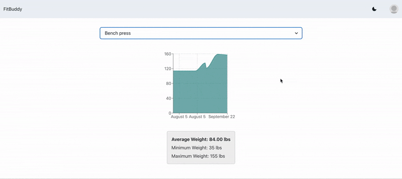
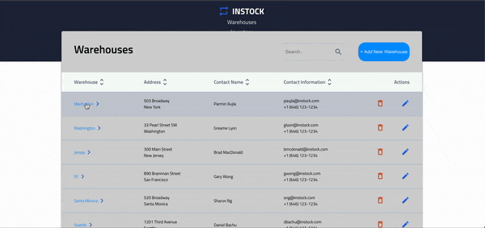
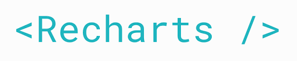

<h1 align="center">👋 Hello and Welcome  my name is Abdullah </h1>

<h3 align="center">I'm a Full Stack Software Engineer living in Toronto, Canada.</h3>

 

  ✨
  
  ✨
  
  ✨

📈&nbsp; I'm currently working as a Software Developer II for TVO -- a media-education company based in Ontario.
 
🏋️‍♀️&nbsp; When I'm not coding, I enjoy working out.

<section align="center">
<h2>💡Projects💡</h2>
<table bordercolor="#66b2b2">
  <tr>
    <td width="50%" valign="top">
      <h3>FitBuddy</h3>

  

    
      

        
<strong>React, FirebaseAuth, Recharts, MySQL </strong> – A personal workout tracker with built in authentication system.

    </td>
<td width="50%" valign="top">
      <h3>Instock</h3>

  

   
      

        
<strong>React, Figma, Node/Express, MySQL</strong> – InStock is an open-source web-based Inventory Management System that helps businesses efficiently manage their inventory and keep track of their stock levels.
 -->
</td> 
  </tr>
</table>
</section>

 

<h2 align="center">:computer: Working Knowledge :computer:</h2>

<table>  
  <tr>
    <td>Languages</td>
    <td align="center" height="108" width="108">
      
       <strong>Python</strong>
    </td>
    <td align="center" height="108" width="108">
      
       <strong>JavaScript</strong>
    </td>
    <td align="center" height="108" width="108">
      
       <strong>TypeScript</strong>
    </td>
    <td align="center" height="108" width="108">
      
       <strong>SQL</strong>
    </td>
    <td align="center" height="108" width="108">
      
       <strong>HTML</strong>
    </td>
    <td align="center" height="108" width="108">
      
       <strong>CSS</strong>
    </td>
  </tr>

  <tr>
    <td>Backend</td>
    <td align="center" height="108" width="108">
      
       <strong>Flask</strong>
    </td>
    <td align="center" height="108" width="108">
      
       <strong>NodeJS</strong>
    </td>
    <td align="center" height="108" width="108">
      
       <strong>Express</strong>
    </td>
  </tr>
   
  <tr>
    <td>Databases</td>
    <td align="center" height="108" width="108">
      
       <strong>PostgreSQL</strong>
    </td>  
     <td align="center" height="108" width="108">
      
       <strong>MySQL</strong>
    </td>  
  </tr>
  
   <tr>
    <td>API</td>
    <td align="center" height="108" width="108">
      
       <strong>REST</strong>
    </td>  
     <td align="center" height="108" width="108">
      
       <strong>GraphQL</strong>
    </td>  
  </tr>
 

 

  <tr>
    <td>Frameworks & Libraries</td>
    <td align="center" height="108" width="108">
      
       <strong>React</strong>
    </td>
    <td align="center" height="108" width="108">
      
       <strong>SCSS</strong>
    </td>
    <td align="center" height="108" width="118">
      
       <strong>Recharts</strong>
    </td>
    
  </tr>
  
  <tr>
    <td>Tools</td>
    <td align="center" height="108" width="108">
      
       <strong>Jupyter Notebook</strong>
    </td>
    <td align="center" height="108" width="108">
      
       <strong>Git</strong>
    </td>
    <td align="center" height="108" width="108">
      
       <strong>VSCode</strong>
    </td>    
  </tr>   
</table>

 

<h2 align="center">:computer: Exposed To :computer:</h2>

<table>  
  <tr>
    <td>Languages</td>
    <td align="center" height="108" width="108">
      
       <strong>C</strong>
    </td>
  </tr>
    
  <tr>
    <td>Frameworks & Libraries</td>
    <td align="center" height="108" width="108">
      
       <strong>React Native</strong>
    </td>
  
  <tr>
     <td>AWS</td>
    <td align="center" height="108" width="108">
      
       <strong>Lambda</strong>
    </td>
    <td align="center" height="108" width="108">
      
       <strong>API Gateway</strong>
    </td>
    <td align="center" height="108" width="108">
      
       <strong>EC2</strong>
    </td>
 
 
  <tr>
    <td>Testing</td>
    <td align="center" height="108" width="108">
      
       <strong>RSpec</strong>
    </td>
    <td align="center" height="108" width="108">
      
       <strong>Cypress</strong>
    </td>
    <td align="center" height="108" width="108">
      
       <strong>Storybook</strong>
    </td>
    <td align="center" height="108" width="108">
      
       <strong>Jest</strong>
    </td>
    <td align="center" height="108" width="108">
      
       <strong>Mocha</strong>
    </td>
    <td align="center" height="108" width="108">
      
       <strong>Chai</strong>
    </td>
  </tr>  
   
  <tr>
    <td>Tools</td>
    <td align="center" height="108" min-width="108">
      
       <strong>Figma</strong>
    </td>
    <td align="center" height="108" min-width="108">
      
       <strong>LATEX</strong>
    </td>
  </tr>   
</table>

 

</section>
