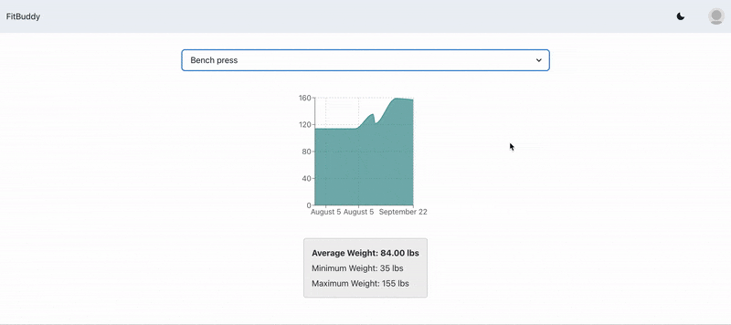
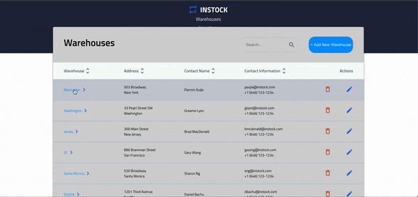

<h1 align="center">👋 Hello and Welcome  my name is Abdullah </h1>

<h3 align="center">I'm a Full Stack Software Engineer living in Toronto, Canada.</h3>

 

  ✨
  
  ✨
  
  ✨

📈&nbsp; I'm currently working as a Software Developer II for TVO -- a media-education company based in Ontario.
 
🏋️‍♀️&nbsp; When I'm not coding, I enjoy working out.

<section align="center">
<h2>💡Projects💡</h2>
<table bordercolor="#66b2b2">
  <tr>
    <td width="50%" valign="top">
      <h3>FitBuddy</h3>

  

    
      

        
<strong>React, FirebaseAuth, Recharts, MySQL </strong> – A personal workout tracker with built in authentication system.

    </td>
<td width="50%" valign="top">
      <h3>Instock</h3>

  

   
      

        
<strong>React, Figma, Node/Express, MySQL</strong> – InStock is an open-source web-based Inventory Management System that helps businesses efficiently manage their inventory and keep track of their stock levels.
 -->
</td> 
  </tr>
</table>
</section>

 

      

 
  
